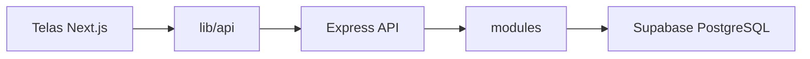
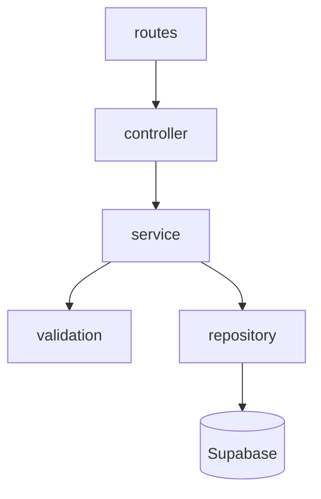

# Arquitetura — Bora Vê Imperatriz

O monorepo separa **frontend** (Next.js), **backend** (Express) e **banco** (Supabase/PostgreSQL). O frontend não acessa o banco: só a API.

## Backend — módulos por funcionalidade

Cada capacidade do produto (auth, favoritos, estabelecimentos…) vira um módulo. Dentro dele, as camadas têm uma responsabilidade só:

| Camada | Arquivo | Faz |
| --- | --- | --- |
| Rotas | `*.routes.ts` | HTTP path + método |
| Controller | `*.controller.ts` | Lê `req`, devolve JSON/status |
| Validação | `*.validation.ts` | Formato dos dados de entrada |
| Serviço | `*.service.ts` | Regra de negócio (hash, unicidade, papéis) |
| Repositório | `*.repository.ts` | Acesso ao Supabase/SQL |
| Tipos | `*.types.ts` | Contratos do módulo |

Fluxo de uma request:

Infra compartilhada fica fora dos módulos:

- `config/` — env e client Supabase
- `shared/errors` — `AppError`
- `shared/http` — `asyncHandler`, `errorHandler`

Não force todas as camadas em todo módulo. Health só tem rota. Login futuro reutiliza `modules/auth`.

### Onde colocar uma feature nova

1. Criar `src/modules/<nome>/`
2. Registrar o router em `app.ts` (`app.use('/api/<nome>', router)`)
3. Lançar `AppError` no serviço/validação — nunca `Error` cru para regra de negócio
4. Senha e dados sensíveis não saem do serviço/repositório

## Frontend — App Router + features

| Pasta | Uso |
| --- | --- |
| `app/` | Páginas e rotas (`/cadastro`, `/login`) |
| `features/<domínio>/` | API e componentes daquela tela/fluxo |
| `lib/api/` | Client HTTP único para o backend |
| `components/` | UI reutilizável (botão, input) quando surgir |
| `types/` | Tipos compartilhados (`PublicUser`) |

Telas em `app/` devem ser finas: layout + chamar o que está em `features/`.

`NEXT_PUBLIC_API_URL` aponta para o Express (`http://localhost:3333` no desenvolvimento).
