# Modelagem inicial do banco — MVP Bora Vê

Documento de referência da estrutura de dados do MVP. A implementação versionada está em [`supabase/migrations/20260914120000_initial_schema.sql`](../supabase/migrations/20260914120000_initial_schema.sql).

**Requisitos cobertos:** RF01–RF15, RN01–RN10, RNF05 e RNF07.

**SGBD:** PostgreSQL (Supabase). Autenticação da aplicação: tabela `users` + `password_hash` (bcrypt na API) + JWT — não usa Supabase Auth neste MVP.

---

## 1. Perfis de acesso

| Perfil | Como surge | O que acessa |
| --- | --- | --- |
| `usuario` | Toda conta criada (RF01) | Preferências, recomendações, favoritos, descoberta |
| `proprietario` | Aprovado em reivindicação (RF10) | Gestão do(s) estabelecimento(s) reivindicado(s), métricas e promoções |
| `administrador` | Atribuição manual | Cadastro/edição manual do catálogo (RF14) e revisão de reivindicações |

Um usuário pode acumular papéis (`user_roles`). O stakeholder “gerente de eventos” do documento de requisitos está incompleto e **não entra no MVP**: eventos são cadastrados pelo administrador (RF14) e podem ser vinculados a um estabelecimento.

A autorização efetiva das rotas fica na API. O schema reforça isso com chaves estrangeiras, papéis e Row Level Security (RLS) como defesa em profundidade. O backend usa a **Service Role Key**, que ignora RLS.

---

## 2. Diagrama entidade-relacionamento

```mermaid
erDiagram
  users ||--o{ user_roles : has
  users ||--o| user_preferences : has
  users ||--o{ user_preference_categories : selects
  users ||--o{ favorite_establishments : saves
  users ||--o{ favorite_events : saves
  users ||--o{ establishment_claims : requests
  users ||--o{ establishment_owners : manages
  users ||--o{ promotions : contracts
  users ||--o{ metric_events : generates

  categories ||--o{ user_preference_categories : used_by
  categories ||--o{ establishment_categories : classifies
  categories ||--o{ event_categories : classifies

  establishments ||--o{ establishment_categories : has
  establishments ||--o{ establishment_photos : has
  establishments ||--o{ establishment_external_ids : identified_by
  establishments ||--o{ establishment_owners : claimed_by
  establishments ||--o{ establishment_claims : claimed_via
  establishments ||--o{ events : hosts
  establishments ||--o{ promotions : promotes
  establishments ||--o{ metric_events : tracks

  events ||--o{ event_categories : has
  events ||--o{ event_external_ids : identified_by
  events ||--o{ favorite_events : saved_in

  promotions ||--o{ metric_events : tracks
  data_sources ||--o{ establishment_external_ids : from
  data_sources ||--o{ event_external_ids : from
  data_sources ||--o{ collection_runs : executes
  collection_runs ||--o{ collection_errors : logs
```



---

## 3. Dicionário de entidades

Tipos enumerados usados no schema:

- `user_role`: `usuario` | `proprietario` | `administrador`
- `price_range`: `economico` | `moderado` | `premium`
- `category_group`: `interesse` | `gastronomia` | `lazer` | `estabelecimento` | `evento`
- `catalog_status`: `ativo` | `inativo` | `pendente_revisao`
- `event_status`: `ativo` | `encerrado` | `cancelado`
- `data_origin`: `scraping` | `cadastro_manual` | `proprietario`
- `claim_status`: `pendente` | `aprovada` | `recusada`
- `promotion_status`: `aguardando_pagamento` | `ativa` | `encerrada` | `cancelada`
- `metric_event_type`: `visualizacao_perfil` | `clique_rota` | `favorito` | `visualizacao_promocao`
- `collection_entity_type`: `estabelecimento` | `evento`
- `collection_run_status`: `em_andamento` | `sucesso` | `parcial` | `falha`

### 3.1 `users`

Conta da plataforma (RF01, RF02, RNF05).

| Atributo | Tipo | Obrigatório | Descrição |
| --- | --- | --- | --- |
| `id` | uuid | sim | PK |
| `name` | text | sim | Nome exibido |
| `email` | text | sim | Login; unicidade case-insensitive |
| `password_hash` | text | sim | Hash bcrypt — nunca senha em texto |
| `created_at` | timestamptz | sim | |
| `updated_at` | timestamptz | sim | |

### 3.2 `user_roles`

Papéis de acesso (RNF05). PK composta `(user_id, role)`. Inclusão automática de `usuario` no INSERT de `users`.

### 3.3 `user_preferences`

Preferências 1:1 com o usuário (RF03, RN07).

| Atributo | Tipo | Descrição |
| --- | --- | --- |
| `user_id` | uuid PK/FK | Usuário |
| `price_range` | `price_range` | Faixa de preço preferida |
| `updated_at` | timestamptz | |

Categorias de interesse, lazer e gastronomia ficam em `user_preference_categories` (N:N com `categories`).

### 3.4 `categories`

Taxonomia compartilhada por preferências, filtros, estabelecimentos e eventos.

| Atributo | Tipo | Descrição |
| --- | --- | --- |
| `id` | uuid | PK |
| `slug` | text UNIQUE | Identificador estável |
| `name` | text | Rótulo |
| `category_group` | `category_group` | Agrupa o uso da categoria |

### 3.5 `establishments`

Catálogo público de estabelecimentos (RF05–RF08, RF10, RF13–RF15).

| Atributo | Tipo | Descrição |
| --- | --- | --- |
| `id` | uuid | PK |
| `name` | text | Nome |
| `name_normalized` | text | Nome para deduplicação (minúsculas, sem pontuação extra) |
| `description` | text | |
| `street`, `number`, `neighborhood`, `city`, `state`, `postal_code` | text | Endereço; cidade/UF padrão Imperatriz-MA |
| `address_normalized` | text | Endereço concatenado normalizado (RN06) |
| `latitude`, `longitude` | numeric | Coordenadas para mapa, distância e rota (RF05, RF08) |
| `phone`, `phone_digits` | text | Telefone original e só dígitos (dedup) |
| `whatsapp`, `email`, `website` | text | Contatos |
| `social_links` | jsonb | Ex.: `{ "instagram": "...", "tiktok": "..." }` |
| `opening_hours` | jsonb | Horários por dia da semana |
| `price_range` | `price_range` | Faixa de preço |
| `status` | `catalog_status` | Visibilidade no catálogo |
| `field_provenance` | jsonb | Origem de cada campo (RN01, RN02) |
| `missing_fields` | text[] | Campos obrigatórios ausentes (RNF07) |
| `created_at`, `updated_at` | timestamptz | |

**`field_provenance` (exemplo):**

```json
{
  "description": "proprietario",
  "opening_hours": "scraping",
  "phone": "cadastro_manual"
}
```

Chaves esperadas: `name`, `description`, `street`, `number`, `neighborhood`, `postal_code`, `latitude`, `longitude`, `phone`, `whatsapp`, `email`, `website`, `social_links`, `opening_hours`, `price_range`. Valores: `scraping` | `cadastro_manual` | `proprietario`.

Hierarquia RN02 na atualização automática: **proprietário verificado > cadastro manual da administração > fonte externa**. A rotina de scraping (RF15) só sobrescreve um campo se a proveniência atual **não** for `proprietario`.

### 3.6 `establishment_categories` e `establishment_photos`

- Categorias N:N do estabelecimento (filtros RF06).
- Fotos: `url`, `alt`, `sort_order`, `is_cover`, `origin` (`data_origin`).

### 3.7 `events`

Eventos do catálogo (RF07, RF13–RF14).

| Atributo | Tipo | Descrição |
| --- | --- | --- |
| `id` | uuid | PK |
| `name`, `name_normalized` | text | |
| `description` | text | |
| `starts_at`, `ends_at` | timestamptz | Data/horário; `ends_at` opcional |
| `establishment_id` | uuid nullable | Local vinculado, se houver |
| endereço / lat/lng | | Usados quando o evento não está em um estabelecimento |
| `price_amount` | numeric | Valor; `NULL` = gratuito ou não informado |
| `status` | `event_status` | |
| `field_provenance`, `missing_fields` | | Mesma lógica dos estabelecimentos |

### 3.8 Favoritos — `favorite_establishments` e `favorite_events`

Relação usuário ↔ item salvo (RF09). UNIQUE `(user_id, establishment_id)` e `(user_id, event_id)`. Tabelas separadas para manter FKs reais.

### 3.9 Proprietários — `establishment_claims` e `establishment_owners`

Reivindicação (RF10, RN03 — método de verificação ainda aberto):

| Atributo | Tipo | Descrição |
| --- | --- | --- |
| `establishment_id`, `user_id` | uuid | Quem pede o quê |
| `status` | `claim_status` | `pendente` / `aprovada` / `recusada` |
| `evidence_text`, `evidence_url` | text | Prova genérica até fechar RN03 |
| `reviewed_by`, `reviewed_at`, `review_notes` | | Auditoria da aprovação |

Um único pedido `pendente` por par usuário–estabelecimento (índice UNIQUE parcial).

Após aprovação: linha em `establishment_owners` (`is_primary`, `verified_at`) e papel `proprietario` em `user_roles`. Proprietário só gerencia estabelecimentos dos quais é owner (RNF05).

### 3.10 `promotions`

Campanhas patrocinadas (RF12, RN08–RN10).

| Atributo | Tipo | Descrição |
| --- | --- | --- |
| `establishment_id` | uuid | Estabelecimento promovido |
| `created_by_user_id` | uuid | Proprietário contratante |
| `objective` | text | Objetivo da promoção |
| `invested_amount` | numeric(12,2) | Valor investido (RN09) |
| `starts_at`, `ends_at` | timestamptz | Período |
| `status` | `promotion_status` | Inclui espera de pagamento |
| `external_payment_id` | text | ID no gateway externo (RN10) |
| `payment_provider` | text | Ex.: stripe, mercadopago — ainda em aberto |

Prioridade de exibição entre campanhas `ativa` no período: maior `invested_amount`. Cota de espaços patrocinados fica na aplicação (RN09).

### 3.11 `metric_events`

Log de interações para o dashboard do proprietário (RF11).

| Atributo | Tipo | Descrição |
| --- | --- | --- |
| `establishment_id` | uuid | Estabelecimento |
| `promotion_id` | uuid nullable | Quando a métrica é de campanha |
| `user_id` | uuid nullable | Visitante autenticado, se houver |
| `metric_type` | `metric_event_type` | Perfil, rota, favorito, promoção |
| `created_at` | timestamptz | Permite filtrar por período |

A quantidade **atual** de favoritos também pode ser `COUNT(*)` em `favorite_establishments`. O log preserva o histórico no tempo.

### 3.12 Origem e coleta — `data_sources`, IDs externos, `collection_runs`, `collection_errors`

| Entidade | Papel |
| --- | --- |
| `data_sources` | Fontes estáveis: `google_maps`, `instagram`, `tiktok`, `manual_admin`, `owner` (RN01, RN04) |
| `establishment_external_ids` / `event_external_ids` | UNIQUE `(source_id, external_id)` — reconciliação do scraping (RF13, RN06) |
| `collection_runs` | Execução da rotina: status, contagens de criados/atualizados/duplicatas ignoradas |
| `collection_errors` | Falhas para análise (RF13, RF15, RNF07) |

---

## 4. Relacionamentos (resumo)

| De | Para | Cardinalidade | Observação |
| --- | --- | --- | --- |
| `users` | `user_roles` | 1:N | Perfis de acesso |
| `users` | `user_preferences` | 1:1 | |
| `users` | `categories` | N:N | Preferências via `user_preference_categories` |
| `users` | `establishments` | N:N | Favoritos |
| `users` | `events` | N:N | Favoritos |
| `users` | `establishments` | N:N | Owners após reivindicação |
| `users` | `establishment_claims` | 1:N | Pedidos de reivindicação |
| `establishments` | `categories` | N:N | |
| `establishments` | `photos` | 1:N | |
| `establishments` | `events` | 1:N | Local opcional do evento (`ON DELETE SET NULL`) |
| `establishments` | `promotions` | 1:N | |
| `establishments` | `metric_events` | 1:N | |
| `data_sources` | entidades do catálogo | 1:N | Via tabelas de ID externo |

Integridade referencial:

- Favoritos e papéis: `ON DELETE CASCADE` com o usuário.
- Métricas: estabelecimento em cascade; usuário `SET NULL` (histórico permanece).
- Owner: `user_id ON DELETE RESTRICT` — não apaga conta que ainda gerencia estabelecimento.
- Evento sem local: `establishment_id` nulo ou `SET NULL` se o local for removido.

---

## 5. Deduplicação (RN06, RNF07)

Mecanismos **no banco**:

1. E-mail de usuário único (`lower(email)`).
2. UNIQUE `(source_id, external_id)` por tipo de entidade (mesmo lugar/evento na mesma fonte).
3. UNIQUE parcial em `establishments.phone_digits` e `lower(website)` quando preenchidos.
4. Colunas `name_normalized` e `address_normalized` + índices para lookup antes do INSERT.
5. UNIQUE em favoritos, papéis e `categories.slug`.
6. UNIQUE parcial: no máximo um claim `pendente` por par usuário–estabelecimento.

Fluxo previsto na aplicação (scraping e cadastro manual, RF13/RF14): consultar ID externo → telefone/site → nome+endereço; em caso de match, **atualizar** o registro existente em vez de criar outro. Comparação fuzzy complementar (acentos, abreviações) permanece na camada de coleta.

---

## 6. Origem dos dados (RN01) e atualização (RN05, RF15)

Três origens previstas:

1. Coleta automática (`scraping`) via `collection_runs` + IDs externos.
2. Cadastro manual da administração (`cadastro_manual` / fonte `manual_admin`).
3. Informações do proprietário (`proprietario` / fonte `owner`), após reivindicação.

Frequência proposta (RN05): estabelecimentos e eventos em rotina diária — controlada pela aplicação, não por constraint. A rotina não apaga informação válida sem atualização correspondente (RF15): campos com proveniência `proprietario` são preservados; `missing_fields` marca lacunas em vez de inventar dado.

---

## 7. Rastreio de requisitos

| Requisito | Como o schema atende |
| --- | --- |
| RF01 / RF02 | `users` (nome, e-mail único, `password_hash`) |
| RF03 / RF04 / RN07 | `user_preferences` + `user_preference_categories` + `categories` |
| RF05 / RF06 / RF08 | lat/lng, endereço, `price_range`, categorias, `status` |
| RF07 | Atributos de detalhe de estabelecimento e evento + fotos |
| RF09 | `favorite_establishments`, `favorite_events` |
| RF10 / RN03 | `establishment_claims`, `establishment_owners` |
| RF11 | `metric_events` filtrável por `created_at` |
| RF12 / RN08–RN10 | `promotions` (período, valor, objetivo, pagamento externo) |
| RF13 / RF15 / RN04–RN05 | `data_sources`, IDs externos, `collection_runs`, `collection_errors` |
| RF14 | Mesmas tabelas de catálogo; origem `cadastro_manual` |
| RNF05 | `password_hash`, `user_roles`, owners, RLS |
| RNF07 | uniques de dedup, `missing_fields`, `field_provenance`, log de falhas |
| RN01 / RN02 | fontes + proveniência por campo |
| RN06 | índices e colunas normalizadas |

---

## 8. Segurança no schema (RNF05)

- Senha apenas como hash.
- RLS habilitada em todas as tabelas de negócio.
- Leitura pública (roles `anon` / `authenticated`) do catálogo **ativo**, categorias, fotos e classificação.
- Políticas `authenticated` para o próprio perfil, próprios favoritos e update de estabelecimento pelo owner (`auth.uid()`).
- Sem políticas de INSERT/DELETE para `anon` no catálogo: escrita passa pela API com Service Role.

Se o JWT da API não for o JWT do Supabase, `auth.uid()` não se aplica ao Express — o que é esperado neste MVP. As policies documentam o modelo de permissão e protegem acesso direto com a anon key.

---

## 9. Evolução posterior

O núcleo do catálogo não precisa ser redesenhado para:

- Novas fontes em `data_sources`.
- Snapshots JSON do payload bruto de scraping.
- PostGIS (`geography`) sobre `latitude`/`longitude` já existentes.
- Papel extra (ex.: gerente de eventos) em `user_roles`.
- Gateway definitivo em `payment_provider` / `external_payment_id`.
- Múltiplos proprietários por estabelecimento (`establishment_owners` já é N:N).

Fora desta modelagem: aplicar a migration no projeto Supabase, implementar APIs, bcrypt e rotinas de scraping.
